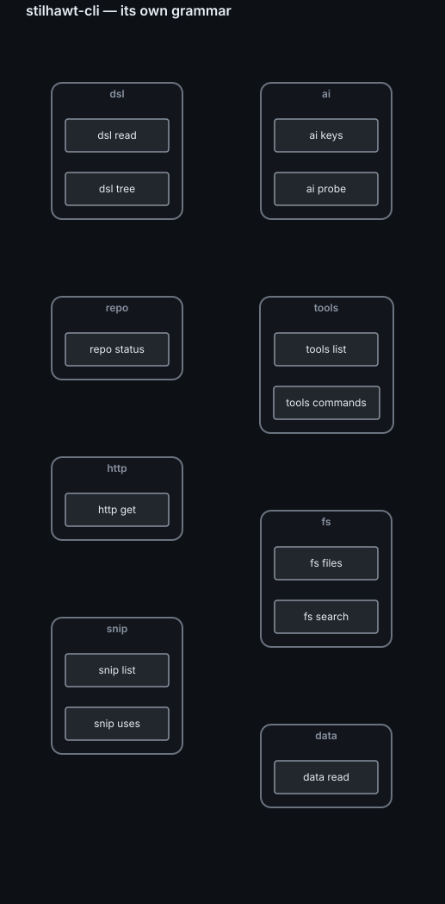

# stilhawt-cli

**A typed, bounded command line for humans and AI agents — with AI pipes you can trust.**

Every command is *declared* in a grammar (a YAML file): what it does, the keys of the objects it
outputs, and its **effect** (`read`, `network`, `write`…). Commands emit JSON Lines; **pipes** filter,
sort, group, join and draw them — and two of them ask a model. A line is checked **before anything
runs**: unknown stages, effects that are not allowed, unbounded repetitions and ungranted commands are
refused with the reason and the correct form.

```text
stilhawt data read examples/reviews.csv | jev "Is this review positive?" --options yes,no --on text --pan texte | group jev.choice
```

One line: read a file, ask a model to *decide* for each row — sending only the `text` field — and
count the answers. The rest of this page is what makes that line safe, bounded and composable.

## Install

```bash
pip install stilhawt-cli              # or "stilhawt-cli[shell]" for tables and completion
stilhawt --check                      # lints the grammar: 0 grievance
stilhawt help
```

`stilhawt` alone opens an interactive shell. Outside a terminal (a pipe, a file, an agent) the output
is always JSON Lines; `--json` / `--text` force either one.

## Keys: Groq and Jev

The two AI pipes use **your** keys, read from the environment at the moment of the call — never stored
by the CLI, never printed.

| Pipe | What it does | Variable | Where to get a key |
|---|---|---|---|
| `groq` | **generates** a short text per object (or one answer with `--all`) | `GROQ_API_KEY` | console.groq.com |
| `jev` | **decides**: picks one of your options per object, with probabilities | `TYPESAFE_API_KEY` | typesafe.ai |

Set a key for the current session:

```bash
export GROQ_API_KEY="<your key>"            # macOS / Linux
$env:GROQ_API_KEY = "<your key>"            # Windows PowerShell
```

To keep it across sessions, put it in your shell profile, or on Windows `setx GROQ_API_KEY "<your key>"`
(new terminals only). **To change a key, set the variable again** — the next call uses the new value; to
revoke one, remove the variable and revoke it at the provider. Never commit a key: a `.env` file that git
ignores, or your system's secret store, is the right place.

Check without ever showing a value:

```text
stilhawt ai keys          # which variables are set
stilhawt ai probe         # one tiny read call per key: valid, refused, unreachable
```

Models: `STILHAWT_GROQ_MODEL` (default `openai/gpt-oss-20b`), `STILHAWT_JEV_MODEL` (default `jev-1.13.0`).
Providers retire models: if a pipe answers 404 while `ai probe` says `valid`, the key is fine and the
model is gone — set the variable to one the provider serves today.

## The AI pipes — the essence

A model is one stage of a pipeline like any other, with three things a raw API call does not give you.

**1. You choose what leaves — field by field.** `--on` names the fields sent; nothing else is.
Private keys (starting with `_`) and what an earlier model added never leave.

```text
stilhawt data read examples/reviews.csv | select id product text
stilhawt data read examples/reviews.csv | groq "What is the complaint, in five words?" --on text --pan texte | select id groq
```

**2. You say what it is — and the guard decides.** Every command declares the *pan* of what it
produces (`texte`, `code`, `donnees` = raw data, `personne`, `image`). `data read` produces raw data, so
without more the egress guard **refuses** to send it:

```text
stilhawt data read examples/reviews.csv | groq "Summarise"
```

is refused before any call. `--on text --pan texte` is you asserting: *this field is prose*. The shipped
guard sends `texte` and `code`, refuses the rest, and does not pretend to anonymise. With no guard
registered, every model pipe is refused (fail-closed).

**3. Decide, then filter on the margin.** `jev` writes no text: it picks one of your options and returns
`{choice, margin, p}`. The **margin** (top − second probability) is what to filter on:

```text
stilhawt data read examples/reviews.csv | jev "Is this review positive?" --options yes,no --on text --pan texte | where jev.margin gt 0.5 | group jev.choice
```

And the two compose — generate, then judge what was generated:

```text
stilhawt data read examples/reviews.csv | groq "Name the main problem in two words" --on text --pan texte | jev "Is this a quality problem?" --options yes,no --on groq --pan texte | select id groq jev.choice
```

**Bounded, and visible before it runs.** Each model pipe declares a maximum number of objects (one
call each); `--all` makes one call for the whole set. `explain` shows the plan — stages, effects, where
data goes, how many calls at most — without calling anything:

```text
stilhawt explain data read examples/reviews.csv | jev "positive?" --options yes,no --on text --pan texte
```

The answer of a model is **data**: added as a field, never executed.

## Navigate a DSL

A DSL here is a YAML (or JSON) document with a closed vocabulary. The CLI reads it as data:

```text
stilhawt dsl tree examples/service.yaml --depth 2
stilhawt dsl read examples/service.yaml "rules[?effect=='write'].id"
stilhawt dsl read examples/service.yaml rules | groq "Is this rule risky? One word." --on value --pan texte
```

`dsl tree` lists every node with its **dotted path** — exactly what `where`, `select` and an AI pipe's
`--on` take — so you find the field, then send only it. `dsl read` selects with JMESPath (jmespath.org).

## Draw it

`view` turns any stream into a local page — nothing leaves your machine. The CLI can draw itself:

```text
stilhawt tools commands | where kind eq command | view graph namespace command --mode contains
stilhawt data read examples/reviews.csv | view bar product stars
```



`view graph` takes two field names and links the value of the first to the value of the second;
`--mode contains` makes each first value a frame around its second values (a grammar, a folder
tree), the default draws edges. `--engine mermaid` writes text
you can paste into a Markdown file. `STILHAWT_VIEW_NO_OPEN=1` writes the page without opening it.

## The language in five minutes

| Stage | What it does | Example |
|---|---|---|
| `where` | keep objects matching one condition | `where stars gt 3` |
| `select` / `sort` / `head` | project, order, cut | `sort -lines \| head 10` |
| `count` / `sum` / `group` | aggregates made by the TOOL | `group language sum lines` |
| `extract` / `replace` | sed-like, into fields, no model | `extract text "^(?P<first>\w+)"` |
| `tee` … `join` | parallel branches, merged by key | `tee (where stars gt 3) (where stars lt 3) \| join id` |
| `each` | one READ command per object, `{}` = its value | `snip uses \| group session \| each session (snip uses --session {})` |
| `diff` | what changed since the last snapshot, by key | `diff reviews --key id` |
| `view` | a local page: table, bars, tree, graph, document | `view bar product stars` |
| `groq` / `jev` | generate / decide, per object or `--all` | see above |

## Generic tools

| Command | What it gives |
|---|---|
| `fs files [dir]` | one row per file: language, kind (code · markup · config/data · doc), lines, vendored |
| `fs search <text>` | a typed grep: file, line, text |
| `data read <file>` | JSON, JSON Lines, CSV, TSV or YAML as rows |
| `repo status [dir]` | every git repository below: branch, modified, untracked, ahead, behind |
| `http get <url>` | status, time, type, size, title |
| `dsl read` / `dsl tree` | navigate a YAML / JSON document |
| `ai keys` / `ai probe` | the model keys: set or not, valid or not — never a value |

Count the code of a project: `stilhawt fs files . | where vendored eq false | where kind eq code | group language sum lines`.

## Adding your own commands

A command maps a **tool verb**. A tool is a Python module that declares its verbs once:

```python
from stilhawt_cli.tool import Arg, Toolset

tools = Toolset("mypkg.inventory")

@tools.verb("hosts", output=["name", "role", "up"], types={"name": "str", "role": "str", "up": "bool"},
            args=[Arg("--role", help="only this role")])
def hosts(role):
    """the hosts of my inventory"""
    return [{"name": "web-1", "role": "web", "up": True}]
```

and the grammar names it (`kind: tool`, `tool: mypkg.inventory:hosts`, its `effect`, its `output`).
`stilhawt --check` verifies the mapping **both ways**. Transports, the egress guard, the key
declarations and where the CLI writes its files are **extension points** (`stilhawt_cli.ext`), filled
by the modules the grammar names under `extensions:` — this package ships `stilhawt_cli.ext_models`.

## Agents: mandates

An agent can be held to a **mandate** (`STILHAWT_MANDAT=<id>`): a declared list of the commands and
pipes it may run. A line using anything else is refused before it runs — the barrier is the grant, not
an instruction in a prompt. Example: `stilhawt_cli/mandats.dsl.yaml`.

## How we use it — and why yours will differ

This package is the core of the CLI we run every day on our own workspace (a few dozen projects, a
fleet of machines, many contracts). There, most commands are **ours**: they read our declarations, our
repositories, our services. They are **not** in this package, and would be of no use as they are —
they show the *kind* of thing the grammar is for. Take the pattern, write your own:

<!-- usage: workspace-only -->
| What we type | What it answers, for us |
|---|---|
| `git status` | every repository of the workspace, dirty or behind |
| `ws search`, `ws files`, `ws projects` | search, line counts, the project census — across all repositories |
| `key find`, `key get`, `dsl get`, `dsl walk` | any identifier of our registries; a contract by its trigram; its lineage |
| `plan show`, `plan list` | the state of a plan, COMPUTED from proofs rather than ticked by hand |
| `fleet map`, `svc health`, `svc logs` | our machines, the health of our services, their logs (secrets masked) |
| `sec report` | the validity and expiry of every declared secret — never a value |
| `gov who`, `gov check` | which session touched a file; every contract's own check |
| `conv find`, `dlg thread` | our past conversations with agents; the dialogue between them |
| `oss check`, `oss push` | how this very package was generated, checked and published |
| `@loc` | a named line: lines of code per language, every project, vendored code left out |
<!-- /usage -->

The point is not these commands: it is that each gesture we used to improvise became **one declared,
typed, bounded line** — for us, and for the agents working with us.

## Tests

Every module carries its own self-test, including cases that **must fail**:

```bash
python -m stilhawt_cli --selftest
python -m stilhawt_cli.std --selftest
python -m stilhawt_cli.ext_models --selftest
```

## License

Apache License 2.0 — see [LICENSE](LICENSE). Copyright 2026 StilHawt.
